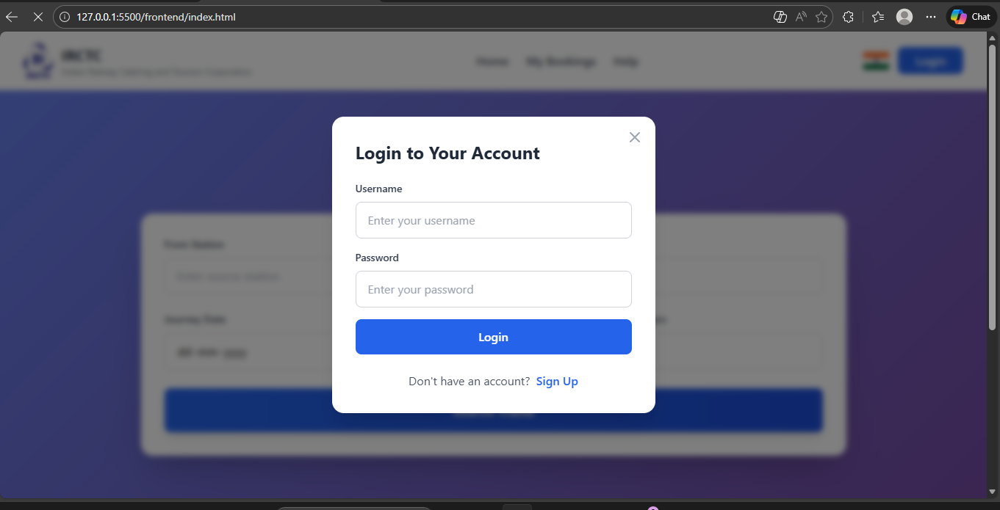
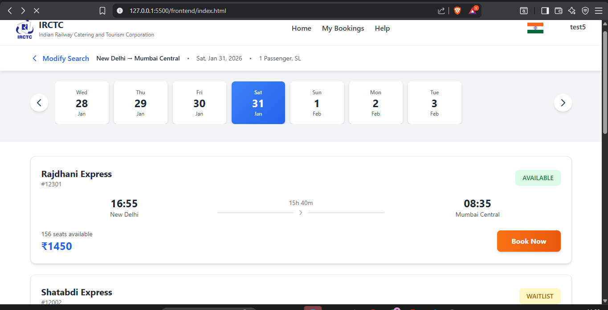
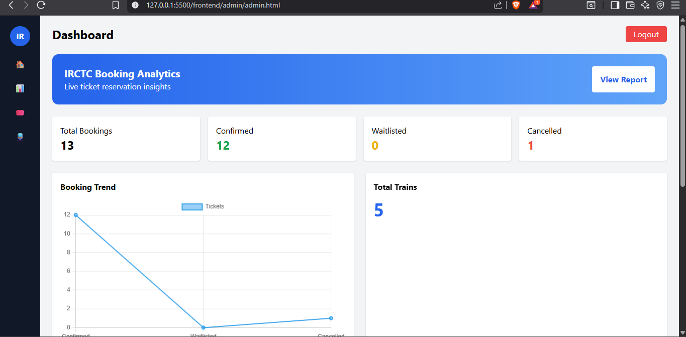
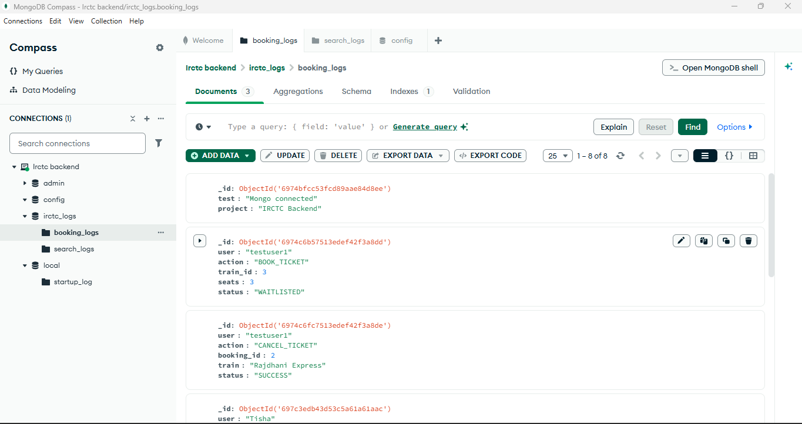

# 🚆 IRCTC Mini Backend System (Django + MySQL + MongoDB)

A production-style IRCTC backend system built using Django REST Framework with real-world concepts like JWT authentication, seat locking, concurrent booking handling, waitlist system, admin analytics, MongoDB logging and rate limiting.

---

## 🔥 Features Implemented

### ✅ Authentication System
- User Registration API
- JWT Login (Access + Refresh Tokens)
- Protected Endpoints

### ✅ Booking Engine
- Real-time seat availability check
- Atomic booking (race-condition safe)
- Seat locking using database transactions
- Auto WAITLIST when seats full
- Auto CONFIRM when cancellation happens

### ✅ Cancellation System
- Seat restore on cancel
- Auto upgrade WAITLIST → CONFIRMED

### ✅ Admin APIs
- View booking statistics
- System monitoring endpoints

### ✅ Database Architecture
- MySQL → Core transactional data
- MongoDB → Booking logs & analytics

### ✅ Security
- JWT Authentication
- Rate limiting (anti abuse)

---

## 🏗 Tech Stack

Backend: Django REST Framework  
Database: MySQL  
Analytics DB: MongoDB  
Authentication: JWT  
Concurrency Handling: Transactions + Row Locking  
API Testing: Thunder Client / Postman  

---
## Login Page

## Landing Page
screenshots/landing page.png

## Booking Page

## Admin Dashboard

## MongoDB Logs

## 📁 Project Structure

irctc_backend/
api/
irctc_backend/
manage.py
requirements.txt
README.md

---

## ⚙️ How To Run Project

### 1️⃣ Clone Repo

git clone https://github.com/Tisha1169/irctc-backend.git  
cd irctc-backend  

---

### 2️⃣ Create Virtual Environment

python -m venv venv  

Activate:

venv\Scripts\activate  

---

### 3️⃣ Install Dependencies

pip install -r irctc_backend/requirements.txt  

---

### 4️⃣ Run Server

python manage.py runserver  

Server URL:

http://127.0.0.1:8000/

---

## 🧪 API Testing Flow

Register  
POST  
/api/register/

Login  
POST  
/api/login/

Book Ticket  
POST  
/api/book/

Header:  
Authorization: Bearer <access_token>

Body:

{
  "train_id": 1,
  "travel_date": "2026-01-30",
  "seats": 1
}

Cancel Booking  
POST  
/api/cancel/

Booking History  
GET  
/api/history/

---

## 👩‍💻 Developer

Tisha Dubey  
NIT Jalandhar  
Backend Developer
